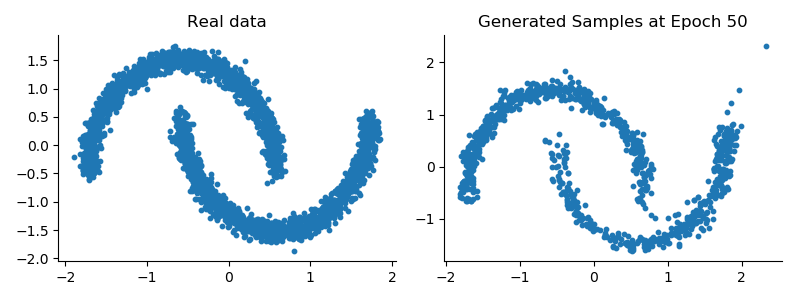
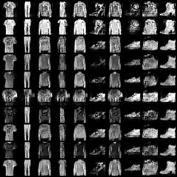
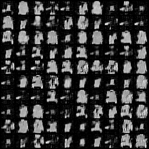

# Flow-Models-and-GANs
Implementations of simple flow models and different GAN versions (Vanilla, Conditional, Wasserstein)

1. **codebase/flow_network.py:** Implementation of Masked Autoregressive Flow (MAF) model on the Moonsdataset

Samples of images of Moons Dataset generated by MAF

2. **codebase/gan.py:** Implementation of non-saturating loss function of GAN, conditional GAN and Wasserstein GAN loss functions

Samples of images of Fashion MNIST with NS Loss GAN 

Samples of images of Fashion MNIST with NS Loss GAN

Samples of images of Fashion MNIST with Wasserstein GAN 

