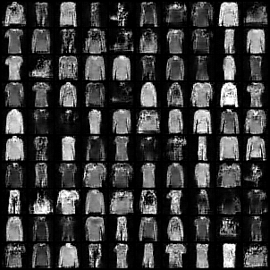

# Flow-Models-and-GANs
Implementations of simple flow models and different GAN versions (Vanilla, Conditional, Wasserstein)

1. **codebase/flow_network.py:** Implementation of Masked Autoregressive Flow (MAF) model on the Moonsdataset

2. **codebase/gan.py:** Implementation of non-saturating loss function of GAN, conditional GAN and Wasserstein GAN loss functions

